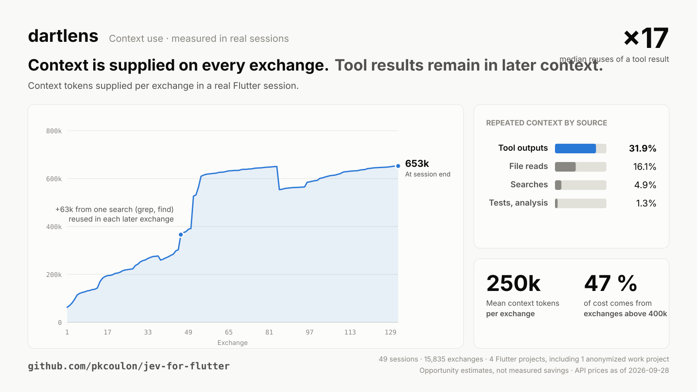
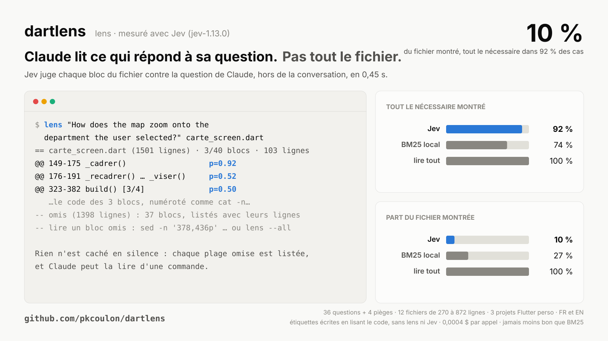
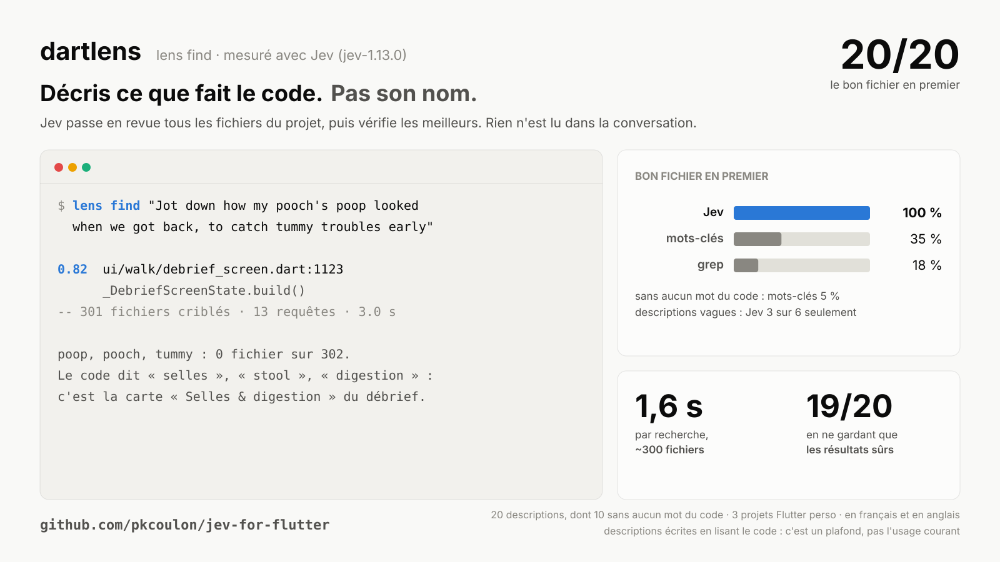
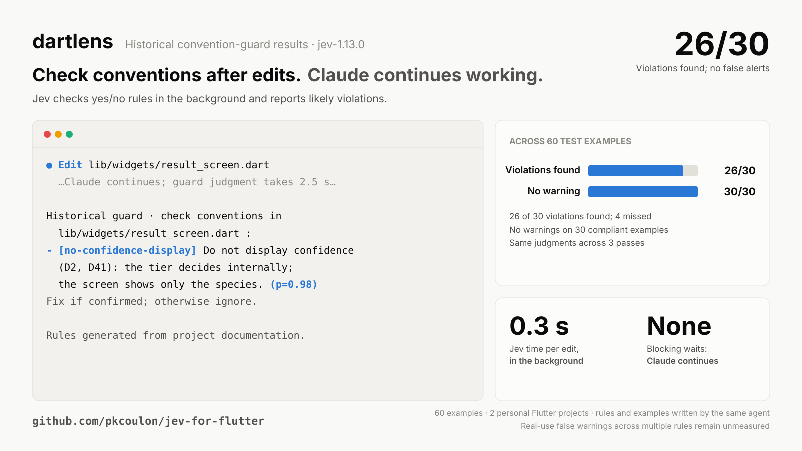

# dartlens

**dartlens aide Claude Code à trouver le code utile dans un projet Dart ou Flutter.**

Quand Claude cherche à comprendre un comportement, dartlens peut lui donner les passages concernés d'un gros fichier, au lieu du fichier entier. Pour choisir ces passages, il utilise Jev, un petit modèle spécialisé de [TypeSafe](https://typesafe.ai). Claude reçoit le texte d'origine, sait ce qui a été laissé de côté et peut toujours lire le fichier complet.

Le but : que Claude consomme moins de tokens pendant son travail, sans travailler moins bien.

dartlens apporte aussi deux autres aides :
- après une modification, il signale une convention du projet probablement enfreinte ;
- à chaque demande, il rappelle une décision ou une consigne du projet qui la concerne.

> **État actuel : prototype.** Le choix des passages donne de bons résultats sur nos premiers essais. Il reste à vérifier deux choses : que Claude s'en sert de lui-même, et que cela fait vraiment économiser sur des tâches complètes. Le rappel de mémoire est encore expérimental.

<picture>
  <source media="(prefers-color-scheme: dark)" srcset="docs/img/why-dark.svg">
  
</picture>

## Pourquoi

À chaque échange, Claude Code renvoie toute la conversation au modèle. Un fichier lu en entier y reste, et il est relu à chaque échange suivant : 17 fois en général, d'après nos sessions.

Sur 49 de nos vraies sessions Flutter, ce que les outils avaient ajouté représentait environ un tiers de ce que Claude relisait. Ce sont des estimations du besoin, pas des économies mesurées.

## Le parcours visé

Tu demandes pourquoi un écran réagit mal. Claude pose sa question sur le fichier concerné :

```bash
lens "Why does the map not zoom onto the selected department?" lib/features/carte/carte_screen.dart
```

Jev choisit les passages qui répondent. Claude les lit, ouvre la zone à modifier, puis corrige.

*C'est le parcours visé. Nos essais ne l'ont pas encore montré sans aide : voir plus bas.*

## Les trois aides

### 1. `lens` : voir les passages concernés, pas tout le fichier

<picture>
  <source media="(prefers-color-scheme: dark)" srcset="docs/img/lens-dark.svg">
  
</picture>

```bash
lens "How does the map zoom onto the selected department?" lib/features/carte/carte_screen.dart
lens "Why does this test fail?" -- flutter test test/foo_test.dart
lens find "where the user records how their dog's digestion went" lib
```

Ce que `lens` laisse de côté est toujours listé, avec la commande pour le lire. Pour un fichier court (150 lignes ou moins) ou une sortie courte (80 lignes ou moins), tout est affiché.

`lens find` retrouve du code à partir d'une description de ce qu'il fait, même quand elle n'emploie aucun mot du code. Quand rien n'est sûr, il le dit.

<picture>
  <source media="(prefers-color-scheme: dark)" srcset="docs/img/find-dark.svg">
  
</picture>

### 2. La garde des conventions

<picture>
  <source media="(prefers-color-scheme: dark)" srcset="docs/img/guard-dark.svg">
  
</picture>

Dans Claude Code, `/dartlens:rules` lit les docs du projet et en tire des questions oui/non, une par convention qu'aucun lint ne sait vérifier. Après chaque modification, Jev les vérifie toutes d'un coup, en arrière-plan. Claude n'est prévenu que si une règle est probablement enfreinte. Rien n'est bloqué.

### 3. La mémoire au bon moment

À chaque demande, Jev choisit parmi tes fiches mémoire et tes skills ce qui la concerne, et Claude reçoit un lien vers la fiche. Une clé de ticket (`ABC-123`) mène directement à sa fiche, même sans Jev.

C'est l'aide la moins aboutie. Sur 40 demandes de test, il a proposé 20 fiches, dont 15 utiles. Mais il en a manqué beaucoup : il en fallait 58. Il ajoute environ 0,4 seconde à chaque demande.

## Comment Claude pense à s'en servir

Un outil qu'il faut rappeler à Claude ne sert à rien. dartlens le lui rappelle donc lui-même :
- au début de chaque session, une consigne courte explique quand utiliser `lens` ;
- quand Claude lit en entier un fichier Dart de 300 lignes ou plus, une note lui propose `lens` pour la prochaine fois. Pas plus de 3 notes par session. La lecture n'est jamais bloquée.

Une option expérimentale va plus loin : elle refuse une fois la lecture complète d'un gros fichier et propose `lens` à la place ; relancer la même lecture la laisse passer (`"lens": {"nudge": "refuse_once"}` dans `.claude/dartlens.json`).

## Sur des tâches complètes

**Premier pilote.** 3 vraies tâches, faites par Claude (Sonnet 5) avec et sans dartlens :
- même réussite dans les deux cas (2 sur 3) ;
- coût un peu plus bas avec dartlens, mais sur un seul essai par tâche, ce n'est pas une preuve ;
- surtout, Claude n'a jamais utilisé `lens`. C'est ce qui a mené aux rappels ci-dessus.

**En cours** : une campagne qui compare, sur 4 tâches, Claude sans dartlens, avec le rappel, et avec le refus expérimental. Résultats ici dès qu'elle est finie.

## Installer

```bash
claude plugin marketplace add pkcoulon/dartlens
claude plugin install dartlens@dartlens

# clé TypeSafe (console.typesafe.ai), jamais dans un dépôt
mkdir -p ~/.config/dartlens && pbpaste > ~/.config/dartlens/typesafe.key && chmod 600 ~/.config/dartlens/typesafe.key
```

Puis, dans chaque projet où tu veux Jev :

```bash
mkdir -p .claude && echo '{"jev": {"enabled": true}}' > .claude/dartlens.json
```

Ensuite, dans Claude Code :
- `/dartlens:rules` écrit les règles de la garde ;
- `! dartlens status` montre si la clé est là, si Jev est activé, et ce qu'il a consommé.

Sans clé ou sans activation, `lens` choisit les passages par mots-clés, sur ta machine, et le dit. La garde et la mémoire se taisent.

## Tes données

- **Rien ne part** chez TypeSafe tant que Jev n'est pas activé dans le projet. Une fois activé, Jev reçoit ce dont il a besoin pour chaque demande : des passages de code, les règles de la garde, les descriptions de tes fiches mémoire.
- **Certains projets sont interdits d'office**, même activés par erreur : ceux que tu listes dans `~/.config/dartlens/policy.json` (`deny_paths`, `deny_remotes`). Typiquement, un dépôt client.
- **Certains formats connus de secrets sont masqués** avant l'envoi. Les fichiers sensibles (`.env`, clés, `google-services.json`…) ne partent jamais.
- **Le modèle est figé** sur `jev-1.13.0`, pour que son comportement ne change pas sans prévenir. TypeSafe héberge aux États-Unis.
- **Coût** : TypeSafe annonce 0,042 $ le million de tokens pour `jev-1.12`. Ce tarif n'est pas confirmé pour `jev-1.13.0`.

## Mesurer toi-même

- `cc-usage` : ce que Claude Code a consommé sur un projet, sans double comptage, valorisé au tarif de chaque modèle. C'est une estimation, pas une facture.
- `docs/need_data.py` et `docs/lens_opportunity.py` : les courbes du besoin, sur tes propres sessions. Seuls des totaux en sortent.
- `bench/` : le banc qui compare Claude avec et sans dartlens sur des copies jetables de projets (`bench/PROTOCOL.md`).

Le détail de nos mesures : [docs/MEASURES.md](docs/MEASURES.md).

## Limites

- **Peu de projets.** Les mesures portent sur 3 projets Flutter perso d'un seul auteur. Les passages attendus et les descriptions de test ont été écrits en lisant le code. Sur des descriptions vagues, `lens find` ne trouve que 3 fois sur 6.
- **Garde : un plafond.** Ses règles et ses exemples ont été écrits par le même agent. Le nombre de fausses alertes en usage réel reste à mesurer.
- **Langue.** Jev est pensé d'abord pour l'anglais. Sur nos mesures, `lens` fait aussi bien en français.
- **Claude Code seulement.** dartlens est un plugin Claude Code. Il ne confie jamais une décision de permission à Jev.
