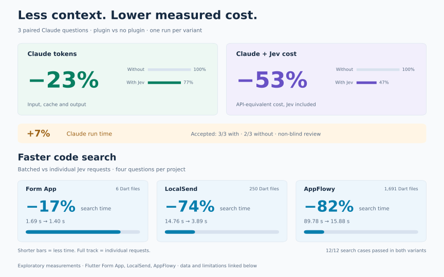

<div align="center">

# Jev for Flutter

<p>
  <a href="https://typesafe.ai">
    <picture>
      <source media="(prefers-color-scheme: dark)" srcset="docs/img/brands/typesafe-dark.png">
      
    </picture>
  </a>
  &nbsp;&nbsp;&nbsp;&nbsp;&nbsp;&nbsp;
  <a href="https://flutter.dev">
    <picture>
      <source media="(prefers-color-scheme: dark)" srcset="docs/img/brands/flutter-dark.svg">
      
    </picture>
  </a>
</p>

**Read less code. Keep Claude focused.**

Focused reads and code search for Flutter, powered by [Jev](https://typesafe.ai).

[Install](#installation) · [Measured benefits](#measured-benefits) · [Demo](#see-it-work) · [Guide](docs/USAGE.md)

</div>

Claude can read hundreds of lines to understand one method. Jev selects the useful passage before it enters Claude's conversation, and searches your Dart code by description.

## Measured benefits

<picture>
  <source media="(prefers-color-scheme: dark)" srcset="docs/img/benefits-dark.svg">
  
</picture>

Three known-file questions, one run per variant, reviewed without blinding. Large files account for the savings; the small file showed none. Search compares batched and individual Jev requests. **These are exploratory results, not guaranteed gains on completed development tasks.** [Method, data and limitations](docs/PUBLIC-PROJECTS.md).

## See it work

[](docs/DEMO.md)

*Animation of a recorded AppFlowy read, with illustrative timing. [Video](docs/img/focused-read-demo.mp4) · [Source and accessible still](docs/DEMO.md).*

- **Focused reads, automatically.** Relevant Dart excerpts with original line numbers. Claude can still request the full file.
- **Search by intent.** Describe a behavior with `jev-flutter find` to find files and lines, even when you do not know the symbol name.
- **Preparation in parallel.** Name a Dart file in your prompt and Jev can prepare the read while Claude reasons.

## Installation

Requires Claude Code, Python 3.9+, macOS or Linux, and a [TypeSafe API key](https://typesafe.ai).

```bash
claude plugin marketplace add pkcoulon/jev-for-flutter
claude plugin install jev-for-flutter@jev-for-flutter
```

Set your key in the shell that launches Claude, or use the [persistent key file](docs/USAGE.md#key-and-activation):

```bash
export TYPESAFE_API_KEY="your-typesafe-key"
```

Start a new Claude Code session in your Flutter project, then enable it:

```text
! jev-flutter init --enable-jev
! jev-flutter doctor
```

Install once; enable once per project. Activation allows relevant code and questions to be sent to TypeSafe. `doctor` checks local setup without paid calls. [Setup and troubleshooting](docs/FIRST-RUN.md).

**MIT licensed.** Claude and TypeSafe usage are billed separately. [Privacy](docs/USAGE.md#privacy) · [License](LICENSE) · [Third-party notices](THIRD_PARTY_NOTICES.md).

<sub>Flutter and the related logo are trademarks of Google LLC. We are not endorsed by or affiliated with Google LLC.</sub>
