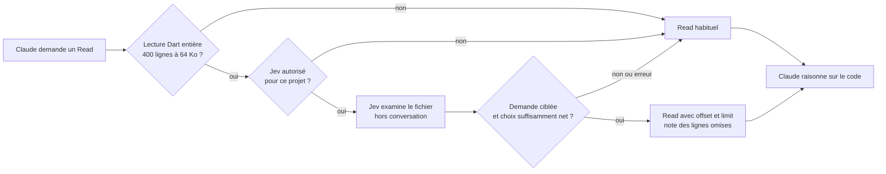

# Architecture de Jev for Flutter 0.3

Le chemin principal réduit une lecture déjà demandée par Claude. La recherche sémantique est disponible à la demande. Le moteur de contexte en arrière-plan, développé et mesuré précédemment, reste facultatif : son dernier essai ajoutait des tokens et du coût.

## Lecture native

`hooks/lens_nudge.py` sélectionne le mode. `lib/dartlens/narrow.py` applique le mode `narrow`, désormais par défaut. Une plage explicite, un fichier généré, un projet exclu, une source hors projet ou l'absence d'activation empêche tout envoi.

La dernière vraie demande utilisateur est extraite du transcript de l'agent concerné ; résultats d'outils et rappels sont exclus. Le fichier entier est masqué avant un découpage en groupes de lignes. Une seule requête Jev évalue en parallèle la localisation (`choice`) et le caractère ciblé de la demande (`noul`). Aucun préfiltre lexical ne décide quelle partie du fichier Jev voit.

Limites : 64 000 octets, estimation de 24 000 tokens pour état et questions, 200 groupes maximum, 3 secondes réseau, aucune relance, 24 requêtes par session au plus. Le hook entier dispose de 4 secondes. Le seuil du choix vaut 0,60 et celui du périmètre ciblé 0,85 ; ce sont des filtres, pas des garanties de rappel.

La fenêtre couvre au moins 150 lignes ou un cinquième du fichier. Si le point choisi est dans une déclaration de fonction reconnue, ses bornes sont incluses. Une fenêtre couvrant plus de 60 % du fichier laisse la lecture intacte. La reconnaissance Dart utilise ici un analyseur syntaxique approximatif, sans compilation ni résolution des types.

Avant livraison : empreinte du fichier et politique revérifiées. `hookSpecificOutput.updatedInput` conserve les autres arguments du Read et ajoute `offset`/`limit` ; il ne modifie pas les permissions. `additionalContext` signale la sélection et comment lire le reste. Un marqueur atomique par session/fichier/contenu/question permet de refaire la lecture entière et évite deux requêtes identiques concurrentes. Les marqueurs ne contiennent pas de source.

Une requête trop large, un score invalide, une erreur ou un dépassement de délai conserve le Read initial. Même avec un score élevé, une sélection peut manquer du code : Claude doit suivre les autres branches utiles. [Contrat officiel des hooks](https://code.claude.com/docs/en/hooks#pretooluse-decision-control).

## Recherche sémantique et audit

`jev-flutter` distribue les commandes vers les modules existants ; `lens` et `dartlens` restent compatibles. `find` examine les déclarations de chaque fichier séparément, avec huit requêtes simultanées au plus, vérifie le contenu intégral des meilleurs candidats quand le budget le permet, puis localise les blocs. Après huit erreurs initiales, il revient au classement local.

**Plus de sélection des 150 premiers fichiers par mots-clés.** Si le périmètre dépasse 150 fichiers, rien n'est envoyé. L'appelant choisit un dossier plus précis ou `--max-files`, plafonné à 3 000. Les scores issus du seul plan sont marqués ; erreurs et exclusions restent visibles. `ask` vérifie une propriété fichier par fichier. Aucun de ces résultats ne garantit un parcours complet ou l'absence d'une fonctionnalité.

## Contexte parallèle facultatif

`context.enabled: true` active `hooks/code_context.py` : préparation détachée au prompt, remise unique au parent ou au sous-agent lors d'un hook ultérieur. Le LLM continue pendant la préparation. Index local par empreinte, BM25 déterministe, jusqu'à huit jugements Jev (quatre simultanés par demande), liens syntaxiques vers d'autres déclarations et plafond de 8 000 octets en automatique.

Les limites et listes de passages non lus sont rendues explicites. Sources modifiées ou résultat trop ancien : pas de livraison. La sélection de départ reste lexicale et peut manquer un fichier sans vocabulaire commun. Deux demandes se chevauchant peuvent laisser huit requêtes déjà envoyées en vol. [Mesures de cette architecture](CONTEXT-RESULTS.md).

Le MCP optionnel `find_code` utilise ce moteur de contexte, et reste désactivé par défaut. Il conserve les contrôles de périmètre et l'annulation des processus. Ne pas le confondre avec le criblage complet de `jev-flutter find`.

## Conventions, mémoire et données

La garde après modification et le routeur de mémoire travaillent en asynchrone. Ils restent actifs, sans prétention d'économie mesurée. Règles absentes ou inapplicables : pas d'alerte de convention.

Jev est désactivé tant que le projet ne l'a pas autorisé. La politique utilisateur historique reste à `~/.config/dartlens/policy.json` ; elle protège aussi les dépôts imbriqués. Les clés TypeSafe peuvent venir de l'environnement ou d'un fichier privé. Cache et journaux restent à `~/.cache/dartlens` pour préserver les installations existantes. Le renommage ne déplace ni n'efface leurs données.

Les fichiers `.env`, clés privées et autres fichiers sensibles sont exclus des envois ; les motifs de secrets connus sont masqués avant découpage. Ce filtrage n'est pas une détection exhaustive. Les métriques de lecture journalisent tailles, durées et identifiants hachés, sans texte source ni question. L'analyse locale peut être forcée avec `--local` sur les commandes compatibles.
