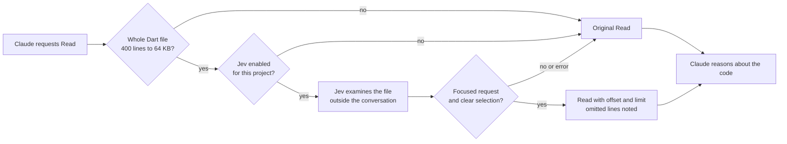

# Jev for Flutter architecture

The main path narrows a read Claude has already requested. Semantic search is available on demand. The earlier background context engine remains optional: its latest measured trial added tokens and cost.

## Native reads

`hooks/lens_nudge.py` selects the mode. `lib/jev_flutter/narrow.py` implements the default, `narrow`. An explicit range, generated file, excluded project, source outside the project or missing activation prevents transmission.

The latest actual user request is extracted from the relevant agent's transcript, excluding tool results and reminders. The whole file is masked before being split into line groups. One Jev request evaluates location (`choice`) and whether the request is focused (`noul`) in parallel. No lexical prefilter decides which part of the file Jev sees.

Limits: 64,000 bytes, an estimated 24,000 tokens for state and questions, at most 200 groups, a three-second network deadline, no retries, and at most 24 requests per session. The complete hook has four seconds. Selection requires scores of 0.60 for location and 0.85 for focused scope; these are filters, not recall guarantees.

The initial window covers at least 150 lines or one fifth of the file. Recognized functions overlapping the selected group are included in full. Version 0.3.2 fixes an incorrect parser-result key that previously prevented this protection from working.

If the request explicitly names exactly one recognized method, in backticks or followed by `(`, the window can shrink to 64 lines. The engine retains its complete declaration and recursively detected same-file declarations referenced in its body. Ambiguous names, more than 32 dependencies or a dependency outside the initial window prevent the additional reduction. This remains approximate, without resolved types or external calls. A window covering more than 60% of the file leaves the read unchanged.

Before delivery, the file fingerprint and policy are checked again. `hookSpecificOutput.updatedInput` preserves other Read arguments and adds `offset`/`limit`; it does not change permissions. `additionalContext` describes the selection and how to retrieve the rest. An atomic marker per session/file/content/question allows a subsequent full read and prevents identical concurrent requests. Markers contain no source code.

Broad requests, invalid scores, errors and deadlines preserve the original Read. Even high scores can omit relevant code: Claude must follow other relevant branches. [Official hook contract](https://code.claude.com/docs/en/hooks#pretooluse-decision-control).

## Parallel read preparation

`UserPromptSubmit` runs `lens_nudge.py prepare` asynchronously. If the prompt names exactly one Dart path, the same engine prepares scores before Read, without adding conversation text. Thresholds, Jev questions and windows are identical. No request is sent without an explicit path, with multiple paths, or outside read limits. Set `read.prefetch: false` to disable this path.

The result is session-local, expires after 90 seconds and contains only Jev scores. Its key includes the file, fingerprint, question, model, API and selection instructions. Any change invalidates reuse. Policy and fingerprints are rechecked before delivery.

An atomic reservation shared by preparation and reads caps them at 24 requests per session. If Read arrives during preparation, it waits within its usual deadline without a second Jev call. Errors are cached, without paid retries. The read marker is separate: preparation does not consume the first focused read, and repeating a read still gives the full file. Unused preparation may cost a request without helping; no additional overall gain is claimed without measurements.

The asynchronous hook has its own four-second deadline and returns no context to the model. [Background hooks](https://code.claude.com/docs/en/hooks#run-hooks-in-the-background) · [Real checks and measurement limits](PREFETCH-RESULTS.md).

## Semantic search and audits

`jev-flutter` dispatches commands to the existing modules; `lens` and `dartlens` remain compatible. `find` batches at most eight file outlines per request. Each file keeps its own question and score, with the question explicitly referencing its group key. Groups are split when they exceed the context budget. Up to eight requests run concurrently. Full source for the top eight candidates is verified when it fits the budget, then relevant blocks are located in the top three.

The first group probes service availability before launching the rest. If no usable judgment returns, search falls back to local ranking. `find.batch_files: 1` restores individual screening. [Real comparison on three public projects](PUBLIC-PROJECTS.md).

**The engine no longer selects the first 150 files by keywords.** If the scope exceeds 150 files, nothing is sent. Choose a narrower directory or raise `--max-files`, capped at 3,000. Outline-only scores are labeled; errors and exclusions stay visible. `ask` checks a property file by file. None of these results guarantees a complete flow or proves that a feature is absent.

## Optional parallel context

`context.enabled: true` activates `hooks/code_context.py`: detached preparation at prompt time, with one delivery to the parent or subagent through a later hook. The LLM continues during preparation. It uses a fingerprinted local index, deterministic BM25, up to eight Jev judgments with four concurrent requests per prompt, syntax links to other declarations, and an automatic 8,000-byte cap.

Limits and unread passages are explicit. Changed sources or expired results prevent delivery. Initial selection remains lexical and can miss files without shared vocabulary. Two overlapping prompts can leave eight already-sent requests in flight. [Measurements](CONTEXT-RESULTS.md).

Optional MCP tool `find_code` uses this context engine and stays off by default. Scope controls and process cancellation are preserved. It is distinct from the complete screening in `jev-flutter find`.

## Conventions, memory and data

The post-edit guard and memory router run asynchronously. They remain enabled, without a claim of measured savings. Missing or inapplicable rules produce no convention warning.

Jev stays disabled until enabled for the project. The user policy at `~/.config/jev-for-flutter/policy.json` also protects nested repositories. Legacy exclusions still apply. TypeSafe keys come from the environment or a personal file. Caches and logs use `~/.cache/jev-for-flutter`, or an existing legacy cache. Renaming moves or deletes no user data.

`.env`, private keys and other sensitive files are excluded from transmission; recognized secret patterns are masked before chunking. This is not exhaustive secret detection. Read metrics record sizes, durations and hashed identifiers, without source or question text. Compatible commands support `--local` to force local analysis.

Generated `*.mapper.dart` files are excluded alongside other known generated formats. A single-file read checks generation markers only in the relevant ancestor directories, without scanning the whole repository.
