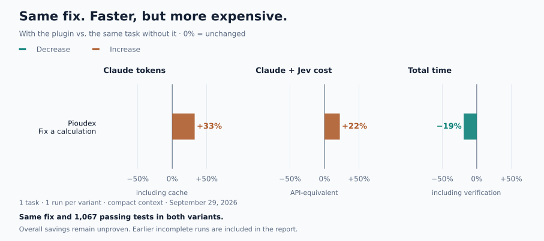

# Essais de la refonte en parallèle — 29 septembre 2026

> Historique : la version 0.3 utilise désormais la lecture native ciblée et garde le contexte automatique en option. Voir [les dernières mesures](READ-RESULTS.md) et [l’architecture actuelle](ARCHITECTURE.md).

Les mesures distinguent deux états du plugin. Les quatre premières sessions ont révélé un problème de transmission du contexte ; le format a ensuite été corrigé. Tous les essais restent dans le bilan.

## Première version : deux recherches d'information

Une session par tâche et par variante, Sonnet 5, effort moyen, mêmes prompts et mêmes critères au sein de chaque paire. Projets personnels épinglés ; aucun dépôt client. Les relectures ci-dessous sont faites par Astra dans la session principale, **ni indépendantes ni aveugles**.

| Mesure | Pioudex sans / avec | Gambade sans / avec |
|---|---:|---:|
| Tokens Claude, cache compris | 440 317 / 358 347 | 436 731 / 449 198 |
| Coût Claude + Jev | 0,3796 / 0,2964 $ | 0,2109 / 0,2194 $ |
| Durée | 119,1 / 74,6 s | 32,4 / 42,3 s |
| Écart de tokens | −19 % | +3 % |
| Écart de coût | −22 % | +4 % |
| Écart de temps | −37 % | +31 % |

**Qualité : aucune réponse ne couvre tous les critères fixés avant ce lot.** Sur Pioudex, le plugin omet le moteur embarqué ; le témoin le cite mais omet `ConfidenceTier.parse` et n'explique pas la construction sans JSON. Sur Gambade, les deux réponses donnent le bon seuil et la bonne source, mais n'expliquent pas le raccordement à l'outil météo de l'assistant. Aucun fichier modifié dans ces quatre sessions. Les écarts favorables sur Pioudex ne constituent donc pas une économie sur un travail complet.

Le mécanisme automatique s'est déclenché dans les deux sessions avec plugin : préparation par Jev en 2,7 s sur Pioudex et 5,4 s sur Gambade, puis remise au sous-agent dans le premier cas et au parent dans le second. Huit requêtes de classement par demande, toutes réussies. Il n'était pas nécessaire que Claude découvre le MCP.

### Défaut observé et correction

Le résultat de 11,4 Ko a été rangé dans un fichier par Claude Code, avec seulement les deux premiers Ko visibles dans la conversation du sous-agent. Les sources étaient donc moins accessibles que prévu. Le plugin limite maintenant la remise automatique à **8 000 octets, UTF-8 compris**, réserve une place aux limites de couverture et présente ensemble les implémentations possibles d'une même méthode.

Les 41 contrôles locaux passent. Le rejeu hors ligne des huit jugements Jev Pioudex, sur les mêmes blocs, produit un contexte compact contenant les conversions, les parcours écoute/photo, l'embarqué et le repli. Aucun appel Jev supplémentaire pour ce rejeu. Cette vérification de format ne certifie pas que le LLM couvrira tous ces éléments.

## Format compact : une correction avec tests

Après le défaut de transport observé, une dernière paire a évalué le format corrigé sur la tâche Pioudex de calcul d'XP. Il s'agit d'une autre tâche que les deux réponses incomplètes ci-dessus ; aucune de celles-ci n'a été relancée. Le plan a été figé avant les appels : témoin puis plugin, 0,85 $ maximum Claude chacun, Jev et réserve compris dans le solde des 5 $.

| Mesure | Sans plugin | Avec contexte compact | Écart |
|---|---:|---:|---:|
| Tokens Claude, cache compris | 574 721 | 761 844 | +33 % |
| Coût Claude + Jev | 0,2818 $ | 0,3446 $ | +22 % |
| Session Claude | 141,0 s | 112,8 s | −20 % |
| Contrôles externes | 26,1 s | 22,7 s | — |
| Total jusqu'aux contrôles terminés | 167,1 s | 135,5 s | −19 % |

Les deux variantes apportent exactement la même modification d'une ligne : le multiplicateur du rang 4 revient de ×4 à ×5. Les tests sont inchangés. Les traces confirment les **1 067 tests passés dans chaque session**, et les cinq contrôles externes passent aussi : célébration, progression, non-régression, analyse et format. Les deux réponses sont acceptées pour cette tâche.

Le hook transmet cette fois **7 677 octets directement dans la conversation**, sans externalisation en fichier. Le correctif de transport est donc aussi vérifié en session réelle. Cela ne garantit pas que toutes les réponses de localisation couvrent désormais leurs branches : les cas incomplets ne sont pas devenus des réussites par cette vérification.

Claude fait 16 appels avec le plugin contre 13 sans lui. La facture augmente essentiellement du côté Claude ; Jev représente 0,000831 $ sur cette paire, contrôle de connexion inclus. Le temps inférieur reste une observation unique : ordre des variantes, caches et latence peuvent contribuer à l'écart. Ne pas annoncer « 19 % plus rapide » comme performance générale.

<picture>
  <source media="(prefers-color-scheme: dark)" srcset="img/context-results-dark.svg">
  
</picture>

**Décision produit :** le contexte automatique et le traitement en parallèle sont opérationnels. La promesse complète — qualité conservée, moins de tokens, moins cher et plus rapide — n'est pas validée. Le README présente l'aide à l'exploration, sans transformer un gain de temps isolé en promesse économique. Les essais montrent qu'ajouter du contexte peut aussi provoquer davantage de recherches ; la quantité préparée n'est pas à augmenter par défaut.

## Coût et traces

Les quatre premières sessions consomment **1,1064 $**, puis la paire sur le format compact **0,6264 $**, au tarif API, Jev et contrôles de connexion inclus. Avec les **1,3053 $** du lot antérieur, le total est **3,0381 $, soit 3,04 $ sur 5 $**. Aucun plafond dépassé, aucune relance des réponses incomplètes, aucun relecteur payant supplémentaire. Le compteur prudent conserve le maximum du coût natif et du coût recalculé, avec une différence inférieure à un dix-millième de dollar.

Les journaux distinguent les tokens Claude d'entrée, écriture cache 5 min, écriture cache 1 h, lecture cache et sortie. Les tokens Jev et son coût sont additionnés séparément. Les durées incluent les outils utilisés par Claude ; aucune commande de test externe n'était requise pour ces deux recherches d'information. Préparation des copies et relecture sont exclues.

Archives privées : `~/.cache/dartlens-bench/context-real-2026-09-29/` et `context-final-2026-09-29/` — plans, copies figées du plugin, requêtes et réponses Jev, traces Claude et sous-agents, diffs, usages et relecture. La clé n'est pas archivée. La première version et le format compact ont des empreintes distinctes.

Données exportées : [première version](context-initial-results.json), [format compact](context-final-results.json). Elles contiennent les usages par classe de cache, les durées, tarifs, réserves de relecture et empreintes des archives. Les SVG sont régénérables avec `uv run --with matplotlib==3.9.4 python docs/readme_charts.py`.

[Architecture](ARCHITECTURE.md) · [Vérifications locales](CONTEXT-REDESIGN.md) · [Mesures avant refonte](EXPERIMENT-5USD.md)
