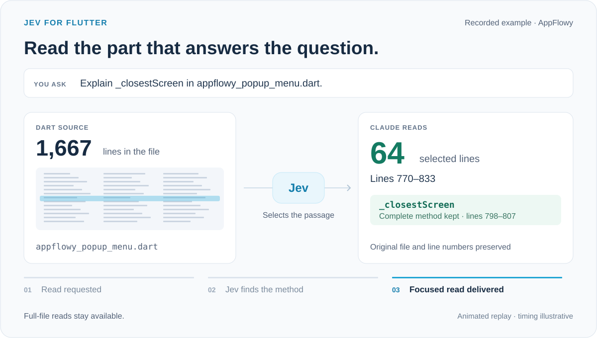

# A focused Dart read

[Watch the animation](img/focused-read-demo.gif) · [Download the video](img/focused-read-demo.mp4)



This animation explains an existing measurement. It is not a screen recording or an interface added to Claude Code. Its timing is illustrative, and the prompt is shortened and translated from the original French. No new API calls were made to produce it.

In the `appflowy-screen-plugin` run, Claude requested `appflowy_popup_menu.dart`, a 1,667-line file. Jev selected lines **770–833**, a **64-line excerpt** containing the complete `_closestScreen` method at lines 798–807. The original file was unchanged, and full-file reads remained available. The answer satisfied the four predefined criteria in that run.

This is one localized question, not a whole-project change. These line counts are not token or cost savings. See [the full benchmark](PUBLIC-PROJECTS.md) for those separate measurements and their limits.

Sources: [recorded result](public-read-results.json), entry `appflowy-screen-plugin`; [pinned AppFlowy source](https://github.com/AppFlowy-IO/AppFlowy/blob/5cf3a365dec0d59f64bad1ee4bb1050471a39b93/frontend/appflowy_flutter/lib/shared/popup_menu/appflowy_popup_menu.dart#L798). The graphic uses an abstract file overview, not a reproduction of AppFlowy's source code.

To regenerate the GIF, MP4 and accessible SVG still from the published results, install `rsvg-convert` and `ffmpeg`, then run:

```bash
python3 docs/render_demo.py
```

Rendering is local and does not contact Claude or TypeSafe.
