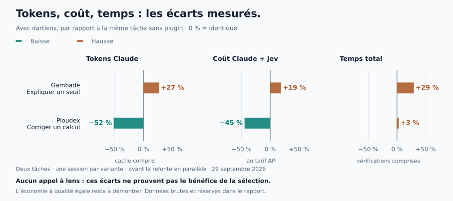

# Two real tasks, four sessions — September 29, 2026

**This campaign finished at $1.3053 of an authorized $5. It does not establish general plugin effectiveness.** The diagnostic task costs less with the plugin; the information search costs more. No session uses `lens` or triggers a large-read refusal, so the differences do not demonstrate benefits from Jev code selection.

## Results

One session per task and variant, with identical prompts. All attempts are retained, without retries. Costs include **Claude and Jev**, including connectivity checks:

| Task | Without plugin | With plugin | Change |
|---|---:|---:|---:|
| Gambade: explain a heat threshold | $0.1958 | $0.2331 | +19% |
| Pioudex: fix XP calculation | $0.5644 | $0.3120 | −45% |

<picture>
  <source media="(prefers-color-scheme: dark)" srcset="img/exploratory-results-dark.svg">
  
</picture>

Percentages use `100 × (with / without − 1)`, rounded to integers. Both tasks use the same scale and scope: Claude tokens including cache, combined cost, session time and external checks. Time runs through completed verification, not time to first response token. No quality-improvement percentage is established.

| Duration | Gambade without / with | Pioudex without / with |
|---|---:|---:|
| Claude session, including its tools and tests | 68.5 / 88.7 s | 198.1 / 197.5 s |
| External automatic checks | 0 / 0 s | 19.2 / 26.6 s |
| Total through completed checks | **68.5 / 88.7 s** | **217.3 / 224.1 s** |

Copy preparation, dependency resolution and answer review are excluded. Gambade checks inspect the answer and diff, without a post-session test command. This campaign shows no speed gain through verified completion.

## Quality checks

Astra accepted all four answers against the frozen requests and criteria. Review occurred in the main session: **neither independent nor blind**, despite masked variant names in exported packets. It does not establish general quality equivalence.

- **Pioudex:** the same one-line fix in both variants, restoring rank 4 to ×5 in `Bareme.multiplicateur`; no tests modified. Traces confirm **1,067 passing tests** in each answer. External celebration, progression, regression, analysis and formatting checks also pass.
- **Gambade:** both answers give the correct 30 °C apparent-temperature threshold for pugs, the decision in `HeatAdvice.evaluate`, the breed profile and PDSA source. No file changes. Reservations: the control conflates consumers of the sensitivity flag and computed level in one sentence; the plugin answer omits the assistant weather-tool connection. Review checked that connection in source. Acceptance does not erase these precision limits.

## What actually happened

**No calls to `lens`, `lens find`, `lens which` or `dart-outline`. No large-read refusals.** Gambade's fully read Dart file is short. On Pioudex, both variants use partial reads directly, leaving no large full read to intercept.

The plugin starts in both relevant sessions. Jev handles two skill-routing requests and one convention check; no link or warning is selected. Two other calls check connectivity. None selects code for Claude.

Pioudex makes 15 Claude calls with the plugin versus 27 in the control, which explores more screen code before correcting the calculation. A single run cannot separate plugin-instruction effects from model variation. Gambade makes 11 calls with the plugin versus nine without. One Python command is denied by benchmark permissions; the Pioudex control also uses an invalid search regex. Both incidents remain in their variants' costs and timings.

## Tokens and complete cost

Claude usage is deduplicated by message, without estimating tokens from characters:

| Category | Gambade without | Gambade with | Pioudex without | Pioudex with |
|---|---:|---:|---:|---:|
| Fresh input | 18 | 22 | 54 | 30 |
| Five-minute cache writes | 0 | 0 | 0 | 0 |
| One-hour cache writes | 26,143 | 28,502 | 55,137 | 37,840 |
| Cache reads | 362,887 | 467,081 | 1,315,135 | 621,559 |
| Output | 1,862 | 2,548 | 8,067 | 3,611 |
| **Claude total** | **390,910** | **498,153** | **1,378,393** | **663,040** |
| Jev input | 0 | 3,376 | 0 | 4,751 |
| Jev output | 0 | 205 | 0 | 284 |

Claude totals count context supplied on every call, including cached context, rather than unique text. Jev tokens remain separate because they belong to another model and price schedule.

API-equivalent valuation: **$1.3049484 Claude + $0.000341334 Jev = $1.305289734**, rounded to **$1.31**. Conservative budget accounting retains $1.30534, taking the larger of native and rounded recalculated cost per session. No overrun, budget stop, rejected Jev call, retry or additional paid reviewer. The remaining $3.69 was not used in this campaign.

Prices checked on September 29, 2026, per million tokens: Sonnet 5 input $2, five-minute cache writes $2.50, one-hour writes $4, cache reads $0.20 and output $10; Jev 1.13 input $0.042 and free output. [Anthropic](https://platform.claude.com/docs/en/about-claude/pricing) · [TypeSafe](https://docs.typesafe.ai/models). These are API-equivalent costs, not subscription bills or quota measurements.

## Conditions and reproduction

- Claude Code 2.1.284, `claude-sonnet-5`, `medium` effort, fresh French-language sessions. Identical conditions within each pair.
- Local fixes after `0de8979`, plugin fingerprint `1581a817ffe4b4a2`, frozen before calls. Defaults: one-time refusal, guard and router enabled, `find_code` disabled. No Dart-helper compilation.
- Disposable copies: Gambade `fcac6e853a1a1ff70fa56c2eb5ec08b17ac7f10c`; Pioudex `91036cc5a13a474a3743c56919b598919cd84500`, with the predeclared calculation bug and hidden history. No customer project.
- Frozen order: Gambade without then with; Pioudex with then without. Claude caps of $0.65 and $1.25 per session respectively, plus a $0.10 Jev cap and reserve. No extra runs after reading results.
- Personal settings and external MCP servers disabled; identical permissions. Real Jev accessed through a local spending-capped proxy that records usage without the key. No fake server.

[Chart data](exploratory-results.json) contains usage, prices, durations, review reservations and evidence hashes. Regenerate light/dark SVGs with `python3 docs/readme_charts.py` and Matplotlib. Plans, snapshots, answers, diffs, tests, usage and reviews remain in the private `~/.cache/dartlens-bench/exploratory-5usd-2026-09-29/` archive.

Offline recalculation, without new paid calls:

```bash
CAMPAIGN_DIR="$HOME/.cache/dartlens-bench/exploratory-5usd-2026-09-29"
python3 -B bench/score.py "$CAMPAIGN_DIR/results/pioudex" --tasks "$CAMPAIGN_DIR/definitions" \
  --reviews "$CAMPAIGN_DIR/reviews/reviews.json" --key "$CAMPAIGN_DIR/review-key.json"
```

Replace `pioudex` with `gambade` for the other pair. Two familiar tasks and one repetition cannot estimate variance or establish benefits on other projects. Flow coverage and useful search timing remain the next problems; `lens` need not be forced when partial reads already suffice.
