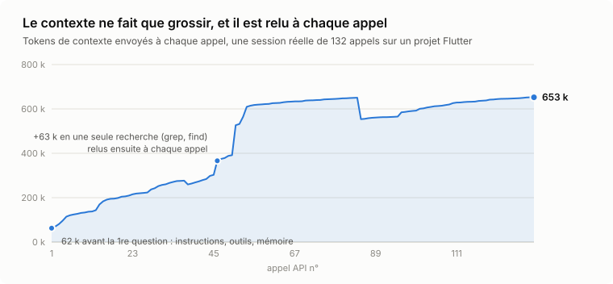
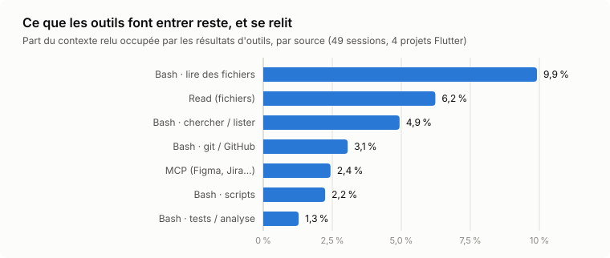
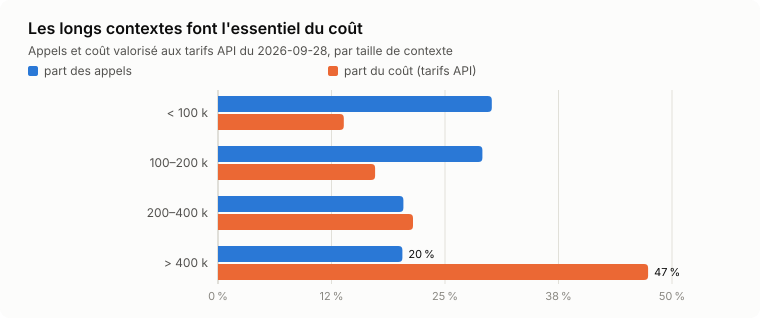
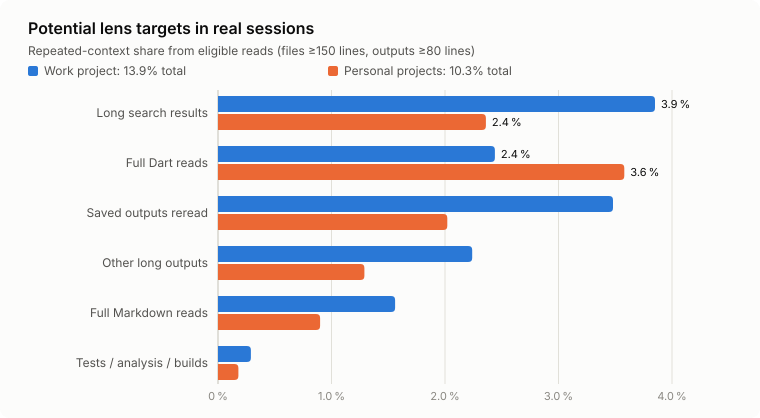

# Mesures de dartlens

Le détail derrière les chiffres du README. Toutes les mesures avec Jev utilisent le modèle `jev-1.13.0` et la clé officielle, sur le code de 3 projets Flutter perso. Les sessions du projet pro n'apparaissent qu'en totaux anonymes.

Trois niveaux, qui ne disent pas la même chose :

| Niveau | Question | Ce qu'on peut en conclure |
|---|---|---|
| Branchement | Le plugin démarre-t-il ? Respecte-t-il les exclusions ? Gère-t-il les pannes ? | Le mécanisme marche. Rien sur la qualité de Jev ni sur une économie. |
| Composants | Jev retrouve-t-il les bons passages, les écarts, les bonnes fiches ? | Les outils peuvent être utiles quand Claude s'en sert. |
| Tâches complètes | Claude s'en sert-il ? Termine-t-il aussi bien ? À quel coût ? | Seul ce niveau peut valider la promesse. Premiers résultats plus bas, sur peu d'essais. |

## Le besoin, sur nos sessions réelles

49 sessions, 15 835 échanges, 4 projets Flutter, dont 1 pro anonymisé. Les usages sont comptés une seule fois par message. Le coût est valorisé au tarif API de chaque modèle au 2026-09-28 : c'est une estimation, pas une facture.

<picture>
  <source media="(prefers-color-scheme: dark)" srcset="img/context-growth-dark.svg">
  
</picture>

<picture>
  <source media="(prefers-color-scheme: dark)" srcset="img/tool-residency-dark.svg">
  
</picture>

<picture>
  <source media="(prefers-color-scheme: dark)" srcset="img/cost-by-context-dark.svg">
  
</picture>

- En moyenne, Claude relit 250 000 tokens à chaque échange.
- Les sorties d'outils font 31,9 % de ce qui est relu. Une sortie d'outil est relue 17 fois en médiane.
- Les échanges au-delà de 400 000 tokens sont 20 % des échanges, mais 47 % du coût.

Ce que `lens` pourrait viser : les fichiers de 150 lignes ou plus lus en entier, et les sorties de 80 lignes ou plus.

<picture>
  <source media="(prefers-color-scheme: dark)" srcset="img/lens-target-dark.svg">
  
</picture>

Ce sont des estimations du besoin, pas des économies. Elles supposent environ 2,3 caractères par token, et qu'une sortie reste dans la conversation jusqu'à la compaction suivante. Le cache, et les lectures nécessaires après un filtrage, changent le coût réel.

## Composants, avec Jev

| Aide | Résultat | Portée |
|---|---|---|
| `lens` | Passages attendus tous présents dans 66 cas sur 72 (91,7 %), contre 73,6 % par mots-clés (BM25). En médiane, 10,1 % des lignes du fichier montrées ; 12,9 % des caractères d'une lecture complète, indications et omissions comprises. Jamais moins bon que les mots-clés. Aucun passage montré pour les 8 questions pièges. Environ 0,45 s. | 36 questions sur 12 fichiers, en français et en anglais : les deux versions d'une question ne sont pas deux cas indépendants. Des passages présents ne garantissent pas que Claude réponde juste. Ce n'est pas une économie sur une tâche. |
| `lens find` | Le bon fichier en premier pour les 20 descriptions (intervalle de confiance à 95 % : 83–100 %) ; 19 sur 20 en ne gardant que les résultats jugés sûrs. Par mots-clés : 35 %, et 5 % sur les descriptions sans aucun mot du code ; grep : 18 %. Environ 1,6 s. | Descriptions écrites en lisant le code. Sur 6 descriptions vagues : 3 réussites. Sur 8 pièges proches, 2 fausses réponses. Un grep naïf ne représente pas toute la façon de chercher d'un agent. |
| Garde | 26 écarts repérés sur 30, 4 manqués ; aucune alerte sur 30 exemples conformes. Mêmes réponses sur 3 passages. Environ 0,3 s de Jev, en arrière-plan. | Règles et exemples écrits par le même agent, surtout synthétiques. Chaque exemple teste sa règle ; une vraie modification en déclenche plusieurs. |
| Mémoire | 20 fiches proposées sur 40 demandes, dont 15 utiles ; il en fallait 58. Au moins une bonne fiche pour 14 des 34 demandes qui en avaient besoin. Dans le top 3 : 60 %, contre 47 % par mots-clés. Skills : 4 bons choix sur 6, aucune fausse suggestion. Environ 0,4 s par demande. | Le seuil n'explique pas tout : le catalogue et la description des fiches comptent aussi. |

**Corrections d'étiquettes.** Des vérificateurs ont relevé des passages attendus mal étiquetés dans le jeu `lens`. Une fois corrigés, Jev passe à 98,6 % et les mots-clés à 79,2 %. Les chiffres ci-dessus restent ceux d'origine.

## Tâches complètes

**Pilote du 2026-09-29.**
- Déroulé : Sonnet 5, un essai par tâche et par variante, avec la vraie clé Jev. Arrêté avant la fin pour préserver le quota.
- Tâches : 3 tâches ont leurs deux essais, avec et sans dartlens.
- Réussite : 2 sur 3 dans les deux cas, d'après les seuls critères automatiques. La relecture des modifications manque encore.
- Coût : 3,11 $ avec dartlens, contre 3,45 $ sans, au tarif API. Sur si peu d'essais, ce n'est pas une preuve.
- Usage : aucun appel à `lens`, `dart-outline` ni au skill. La garde a tourné sans fausse alerte.

**Campagne d'adoption du 2026-09-29** (`adoption-2026-09-29`).
- Tâches : 4, toutes sur Pioudex, au commit `91036cc`.
- Variantes : 3, garde et mémoire actives dans les deux variantes avec plugin.
  - Sans dartlens.
  - `all` : consigne au démarrage, puis une note sur chaque lecture complète d'un fichier Dart de 300 lignes ou plus, au plus 3 par session.
  - `all_refuse` : consigne au démarrage, puis arrêt unique de cette lecture. C'est le réglage par défaut depuis.
- Déroulé : Sonnet 5, un essai par tâche et par variante, avec la vraie clé Jev.
- Réussite : critères automatiques **et** accord d'un agent relecteur, à qui l'on n'a pas dit quelle variante avait produit le travail.

| Tâche | Sans dartlens | Note | Arrêt |
|---|---|---|---|
| `loc-silence` (localiser) | échec, 0,96 $ | réussite, 0,80 $ | réussite, 0,67 $ |
| `diag-gain-xp` (diagnostiquer) | réussite, 0,77 $ | réussite, 1,06 $ | réussite, 1,17 $ |
| `convention-olive` (convention) | échec, 1,14 $ | échec, 0,33 $ | échec, 0,62 $ |
| `memoire-vibrations` (mémoire) | échec, 3,35 $ | échec, 3,97 $ | échec, 2,67 $ (coupé à 25 min) |
| **Total Claude** | **1 sur 4, 6,23 $** | **2 sur 4, 6,16 $** | **2 sur 4, 5,12 $** |
| Jev, tokens (tarif publié pour `jev-1.12`) | 0 | 32 197 (≈ 0,001 $) | 125 808 (≈ 0,005 $) |

### Ce que Claude a reçu

Mesuré par `bench/adoption.py` : code Dart effectivement reçu, par outil. Les caractères comprennent les numéros de ligne de Read.

| | Sans dartlens | Note | Arrêt |
|---|---|---|---|
| Read complet | 26 appels, 450 010 car. | 19, 318 533 | 8, 56 395 |
| Read avec plage | 12, 26 511 | 6, 25 247 | 9, 24 984 |
| `lens` (lignes montrées / totales) | — | — | 10 appels, 1 367 / 5 995, 72 564 car. |
| Shell (`sed -n`…) | — | — | 2, 3 235 |
| **Code Dart reçu** | **476 521 car.** | **343 780** | **157 178** |
| Fichiers Dart de 300 lignes ou plus reçus entiers | 14 | 10 | 1, par `lens` |
| Notes ou arrêts affichés | — | 9 notes | 8 arrêts |
| Lecture complète redemandée après un arrêt | — | — | 0 |

Le fichier reçu entier par `lens` fait 507 lignes. La question de Claude portait sur la structure de tout l'écran de réglages, et Jev a jugé utiles les 23 morceaux.

Parcours observés après les arrêts :
- **olive** : 2 arrêts, 2 questions à `lens`, puis la modification, sans relire la zone avec Read.
- **diagnostic** : arrêt, `lens`, recherches et lectures ciblées, puis la correction.
- **localisation** : arrêt, `lens`, recherches, puis la réponse. Aucune modification n'était demandée.
- **vibrations** : arrêt, `lens`, puis une longue exploration (recherches, fiches mémoire), puis l'écriture.

### Coût : ce qu'on peut dire

- Le total baisse de 18 % avec l'arrêt, échecs compris. Tâche par tâche, le rapport au témoin va de 0,54 à 1,52, avec une médiane de 0,74.
- Sur les 2 tâches réussies par les deux variantes du plugin (localisation et diagnostic), le coût est presque le même : 1,86 $ avec la note, 1,83 $ avec l'arrêt. Environ 97 % de l'écart total vient des tâches échouées.
- Le diagnostic, seule tâche réussie partout, coûte 0,77 $ sans plugin et 1,17 $ avec l'arrêt.
- **Conclusion** : l'arrêt divise par trois le code reçu, mais une économie sur un même travail terminé n'est pas démontrée.

### Qualité : ce qu'on peut dire

- **Rejeu.** Les vérifications ont été rejouées sur un clone propre, avec les mêmes résultats sur les 12 essais. Au départ, tout passe (339 tests, analyse, formatage), sauf le bug semé exprès pour le diagnostic.
- **Tests cassés.** Dans les trois variantes, la tâche vibrations casse 2 tests qui passaient avant.
  - Sans plugin et avec la note : le nouveau panneau pousse la carte « À propos » hors de l'écran de test.
  - Avec l'arrêt : une clé de traduction sans utilisateur, et un fichier généré pas à jour.
  - Le relecteur ne voyait pas les tests : son « aucune régression » ne vaut pas pour eux.
- **Olive**, refusée dans les trois variantes. C'est un vrai manque de l'agent, le même partout, et le plugin n'y joue aucun rôle.
  - Les critères automatiques passaient déjà sans aucune modification.
  - Aucune variante ne vérifie ce que la nouvelle couleur touche. Le texte crème est à 4,55:1, juste au-dessus du seuil. Le motif en filigrane tombe vers 1,34:1, sous le minimum du design system.
  - La grille avait été écrite avant la campagne.
- **Vibrations**, jamais aboutie.
  - Le témoin s'arrête à 60 tours. La note « termine » en laissant ses tests tourner en arrière-plan : l'un d'eux bloque. L'arrêt est coupé à 25 minutes.
  - La tâche est serrée : `DECISIONS.md` fait 299 Ko et coûte 7 à 9 tours de détour.
  - Le routeur a bien classé les 5 fiches utiles en tête, sans que ça suffise.
- **Verdict.** Avec 4 tâches et un essai chacune, `score.py` n'affiche plus de verdict de qualité.

### L'environnement a faussé les durées

26 demandes de permission sont restées bloquées environ 115 s chacune avant d'être refusées.
- Le hook utilisateur `rtk` réécrivait des commandes autorisées en commandes hors liste.
- Un lanceur de terminal (cmux) passait devant le vrai binaire `claude`. Il est suspect, sans preuve directe.
- Sur vibrations, cela représente 691 s sans plugin, 461 s avec la note et 807 s avec l'arrêt.
- **Les durées de cette campagne ne sont pas exploitables.** Pour l'essai coupé à 25 minutes, on sait seulement que plus de la moitié du temps s'est passée à attendre, et que chaque appel à `lens` a pris moins d'une seconde. L'effet de l'arrêt sur la suite du travail n'est pas établi.
- Depuis, `run.py` écarte par défaut les réglages utilisateur et le lanceur (`bench/PROTOCOL.md`).

### Suite

1. Refaire, avec le banc isolé, quelques tâches que Claude sait réussir et assez différentes, dont une où il faut vraiment lire tout un fichier. Plusieurs essais par tâche.
2. Pour les prochaines versions des tâches, sans ré-noter celle-ci :
   - olive : préciser que « vérifier » veut dire « en rendre compte », et dire si la bande de barre d'état fait partie du travail ;
   - vibrations : revoir le budget de tours.

## Rejouer

- Besoin : `python3 docs/need_data.py …` puis `python3 docs/charts.py …`, et `docs/lens_opportunity.py`.
- Banc : `bench/PROTOCOL.md`, puis `bench/run.py` et `bench/score.py`.
