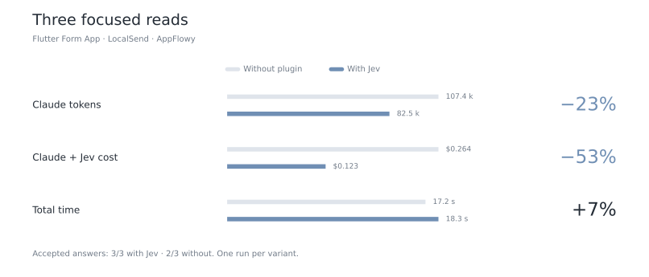

# Benchmarks on three public Flutter projects

Batching requests speeds up search, especially in large projects. Focused reads reduce observed Claude cost, but do not yet make its answers faster. **This campaign measures search and code comprehension, not completed development tasks.**

## Projects and sources

| Project | Scope | Dart files screened | Pinned revision |
|---|---|---:|---|
| Flutter Form App | Official sample, `form_app/lib` | 6 | [8a4cf1d](https://github.com/flutter/samples/tree/8a4cf1db16d52741f0e59e1bfe818723430c35bc/form_app) |
| LocalSend | Application and two Dart packages | 250 | [c5bbe36](https://github.com/localsend/localsend/tree/c5bbe3630bb50e0de8253502b41523c4a58825bb) |
| AppFlowy | `appflowy_flutter/lib` and packages | 1,691 | [5cf3a36](https://github.com/AppFlowy-IO/AppFlowy/tree/5cf3a365dec0d59f64bad1ee4bb1050471a39b93/frontend/appflowy_flutter) |

Generated code, tests and policy-excluded files were omitted. AppFlowy's initial inventory contains three additional Dart files excluded by policy. Rust backends and native platforms are outside the scope. No application builds or modifications were performed.

## Search: the same files, fewer requests

The same engine was compared with **one file per request** and **up to eight files per request**. Each file retains a separate judgment; the best candidates are then checked against their source code. No keyword-based preselection excludes files from screening.

| Project | Mean time: individual → batched | Change | Mean Jev cost per search | Change |
|---|---:|---:|---:|---:|
| Form App | 1.69 → 1.40 s | **−17%** | $0.000533 → $0.000475 | −11% |
| LocalSend | 14.76 → 3.89 s | **−74%** | $0.007977 → $0.005587 | −30% |
| AppFlowy | 89.78 → 15.88 s | **−82%** | $0.047691 → $0.030974 | −35% |

**12 out of 12 searches satisfy the rubric in each variant.** Each project has two targeted searches, including one in French, one absent-feature search, and one flow spanning two files. Both variants retrieve both required files for all three flows. No LLM answers are assessed in this part.

A positive case passes when all expected paths appear in the top five with a score of at least 0.60. Additional paths are not penalized. A negative case passes when no path reaches that threshold. This checks selected cases; it does not establish perfect recall on other projects.

Four different questions per project, **one execution per question and variant**. Alternating order, the same `jev-1.13.0` model, at most eight concurrent requests, and the same approximate outline parser. The file cap was explicitly raised to 3,000 and the network deadline to 180 seconds to allow the individual-request AppFlowy comparison. The default remains 150 files and 20 seconds; larger scopes require an explicit choice.

[Data, questions, expected paths and ranked outputs](public-search-results.json).

## Claude reads: cost, tokens and quality

Three questions fixed before the calls, one per project. Only `Read` is available in both variants, with the same source copied into an isolated project, identical prompts, Sonnet 5 and medium effort. The plugin uses its default settings. Each answer must cover four criteria; a single omission means rejection.

<picture>
  <source media="(prefers-color-scheme: dark)" srcset="img/public-read-results-dark.svg">
  
</picture>

| Question | Accepted: without / with | Cost without → with, including Jev | Time without → with |
|---|---|---:|---:|
| Form App: sign-in request and HTTP statuses | Yes / Yes | $0.03795 → $0.03856 | 4.44 → 4.99 s |
| LocalSend: representation of large and small sessions | No / Yes | $0.08249 → $0.04461 | 7.11 → 7.70 s |
| AppFlowy: closest screen, ties and empty input | Yes / Yes | $0.14346 → $0.03978 | 5.64 → 5.64 s |

The LocalSend control answer does not explicitly describe small sessions in the mixed case. It remains included in every total. Review by Astra, **neither independent nor blind**; answers and criteria are published for reassessment.

The Form App file has 111 lines: no read narrowing or saving is expected. The other files have 851 and 1,667 lines; each explicitly named method and its detected local dependencies fit within 64 lines. Expected passages are preserved. On LocalSend, Claude makes an extra one-line read before the focused read; it is included.

Claude tokens include input, cache writes, cache reads and output: **107,419 → 82,505**. Jev separately processes 45,262 input tokens and 2,923 output tokens for this part. **The combined token count across both models does not decrease**: some work moves to the cheaper model. Cost also includes three router calls, which considered 18 personal skill descriptions without suggesting any. Test projects had no memory entries or rules.

Claude costs are reported by the sessions and reconciled against deduplicated messages and cache categories. They are API-equivalent costs, not a measurement of subscription quota. Runtime uses Claude's reported `duration_ms`. One session per variant cannot attribute every difference to the plugin or estimate variance.

[Data and full answers](public-read-results.json). The measured candidate engine was frozen before the internal package rename and addition of local `init` and `doctor` commands. The renamed distribution passed the offline checks; these measurements are not a second paid campaign on that final packaging.

## Checks and reproduction

The README's benefit charts are generated directly from the two published JSON result files. Redraw them locally, without API calls:

```bash
uv run --with matplotlib==3.9.4 python docs/readme_charts.py --benefits-only
```

- Two whole-file review requests preserve the entire file; two repeat reads also retrieve it in full, using real Jev.
- 200 recognized methods, sampled from LocalSend and AppFlowy with a fixed seed, remain intact in the proposed ranges or full reads. This checks the approximate parser, not resolved types or model relevance.
- Local checks cover nearby and distant dependencies, large methods, caps, generated code, outages, explicit ranges, excluded projects, concurrency, invalidation and compatibility.
- Marketplace installation and manifests are checked in an isolated Claude configuration. Activation and diagnostics make no network calls.

To reproduce the search comparison from an authorized pinned checkout, use:

```json
{"jev":{"enabled":true,"cli_timeout_s":180},"find":{"batch_files":1}}
```

```bash
jev-flutter find "BENCHMARK_QUESTION" BENCHMARK_PATHS --max-files 3000 --top 5 --min 0.6
```

Then change `batch_files` to `8`, keeping the question and sources unchanged. Questions, scopes, revisions and criteria are in the linked JSON files. Reproduction calls TypeSafe and consumes credit. Raw API receipts, transcripts and pinned sources are retained in the private `flutter-public-2026-09-29` campaign archive; not all are published here. Recorded prompts and answers retain their original language.

A final session using the renamed package, in a path containing spaces and accented characters, passes all four AppFlowy criteria. `init`, `doctor`, preparation and the 64-line read work; the source stays unchanged. It is separate from the three measured pairs: $0.038383 Claude and $0.001149 Jev.

**Total spend, including final integration: $0.379057 TypeSafe for 8,999 requests; $0.423417 Claude, conservatively accounted.** The $10 TypeSafe budget is a ceiling, not a spending target. The earlier Claude budget remains respected. Jev pricing: [$0.042 per million input tokens, output free](https://docs.typesafe.ai/models).

## Flutter-specific safeguards

A Flutter feature can span a view, state logic, repository and service. Finding its screen is not enough to explain the flow; the multi-file cases target this limitation. This applies the [official Flutter architecture guide](https://docs.flutter.dev/app-architecture/guide) without imposing MVVM on projects using BLoC or Riverpod.

An outline is not resolved type analysis. The official [`parseString` API](https://pub.dev/documentation/analyzer/latest/dart_analysis_utilities/parseString.html) distinguishes syntax parsing; launching a full analysis server for each read would add avoidable work. [Dart analyzer performance guidance](https://dart.dev/tools/analyzer-performance) supports limiting scope and repeated computation. Precise syntax parsing remains optional, and full reads remain available.
