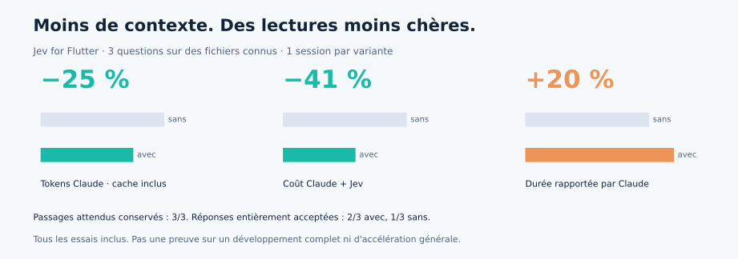

# Lectures ciblées : mesures de la version 0.3

Le 29 septembre 2026, trois paires de sessions Claude Sonnet 5, effort moyen, évaluent le nouveau hook de lecture. **Le coût baisse sur ces trois cas, le temps augmente au total.** Les critères de réponse, prompts, sources et plafonds étaient fixés avant les appels ; aucun essai n'a été relancé.

| Somme des trois sessions | Sans plugin | Jev for Flutter | Variation |
|---|---:|---:|---:|
| Tokens Claude, entrées/cache/sorties | 102 780 | 76 974 | **−25 %** |
| Coût Claude + Jev | 0,247752 $ | 0,145253 $ | **−41 %** |
| Durée rapportée par Claude | 20,638 s | 24,786 s | **+20 %** |
| Appels Read | 3 | 3 | aucun appel supplémentaire |
| Réponses entièrement acceptées | 1/3 | 2/3 | échantillon trop petit pour un taux |

Tous les essais, y compris les réponses imparfaites, entrent dans ces sommes. Le pourcentage de tokens concerne **Claude**. Jev a traité séparément 40 954 tokens d'entrée et 2 234 de sortie, pour 0,001720 $ compris dans le coût ci-dessus. En additionnant les tokens des deux modèles, le volume traité augmente : la délégation utilise davantage le petit modèle et moins Claude.



## Périmètre exact

Trois questions sur une fonction précise dans un fichier déjà connu : action d'une notification (Gambade), invalidation des caches de synchronisation (Pioudex), promotion d'un palier audio (Pioudex). Seul l'outil Read est disponible dans **les deux variantes**, pour isoler la lecture. Le prompt ne nomme pas Jev et n'impose pas une lecture entière ; les six sessions ont choisi un seul Read sans plage.

Le plugin complet est chargé avec ses valeurs par défaut. Les copies de projet n'ont ni mémoire ni règles locales. Le routeur a tout de même émis trois requêtes, incluses dans le coût. Chaque variante reçoit le même fichier extrait du même commit. Aucune source n'a été modifiée.

Sources : Gambade `fcac6e853a1a1ff70fa56c2eb5ec08b17ac7f10c`, Pioudex `91036cc5a13a474a3743c56919b598919cd84500`. Identité du plugin et empreintes des fichiers dans [les données](read-results.json). Les détails de marque et d'aide ont été finalisés après le gel ; l'algorithme de sélection et ses valeurs par défaut sont ceux testés.

Ce lot ne teste ni une recherche libre sur tout un dépôt, ni un correctif terminé avec ses tests. Il vise le cas dans lequel le hook agit : une question localisée et une lecture complète évitable. Les précédents essais de développement restent dans [CONTEXT-RESULTS.md](CONTEXT-RESULTS.md), y compris leurs résultats défavorables.

## Qualité : contrôle des sources puis des réponses

| Cas | Plage fournie par le plugin | Passage attendu présent | Réponse sans / avec |
|---|---|---|---|
| Notification | 16–165 sur 590 lignes | oui, méthode entière | refusée / acceptée |
| Caches | 466–616 sur 755 lignes | oui, méthode entière | refusée / refusée |
| Accords audio | 304–453 sur 453 lignes | oui, méthode entière | acceptée / acceptée |

La réponse notification sans plugin omet le traitement d'un payload vide, critère prévu. Sur les caches, les deux réponses inversent dans leur prose l'ordre de mise à jour de l'identité et du vidage des caches ; le code cité par la variante plugin est pourtant correct. Les deux réponses sur le palier audio couvrent garde `none`, nombre d'accords, échelle et plafond.

La seule paire avec deux réponses entièrement acceptées est donc le palier audio : **−19 % de tokens Claude, −33 % de coût et −11 % de durée**, une exécution chacune. Ce sous-ensemble est identifié après relecture ; il n'est pas utilisé seul comme graphique principal.

Relecture par Astra dans cette session, ni indépendante ni aveugle. Aucun juge payant. Les passages présents ne garantissent pas une réponse correcte : ce sont deux contrôles distincts. La note des lignes omises a été retrouvée intégralement dans les trois transcripts Claude Code, sans fichier d'externalisation.

## Replis et vérifications

- 28 contrôles hors ligne : arguments Read, récupération du fichier entier, concurrence, erreurs, source changée, exclusions, secrets, compatibilité et plafond de recherche.
- 6 requêtes Jev réelles supplémentaires : revue complète, plusieurs comportements, parcours de synchronisation complet, comparaison audio/photo et deux comportements absents. **6/6 lectures laissées inchangées** ; coût 0,002812 $.
- Temps du hook observé sur les trois lectures ciblées : 364, 400 et 412 ms. Ce n'est pas le temps de réponse de Claude.

Les seuils n'ont pas été ajustés sur ces six contrôles. Ils réduisent le risque d'omission sans le supprimer. Aucun gain général de qualité ou de vitesse n'est établi.

## Comptage, reproductibilité et budget

Le coût annoncé est celui retourné par Claude, contrôlé contre les usages API dédupliqués et les classes de cache, plus les entrées Jev à 0,042 $/million (sortie gratuite). Les durées utilisent `duration_ms` de Claude ; les temps de processus, moins précis à cause du suivi toutes les deux secondes, sont également conservés dans les données.

Ordre des variantes : sans/avec, avec/sans, sans/avec. Une répétition par cas, aucune estimation de variance, pas de réglage personnel ni de MCP connecté. Les variations de génération, du cache et de l'API restent des facteurs possibles. On mesure un cas favorable et limité, pas une garantie pour tous les utilisateurs.

Le nouveau lot a consommé **0,396 $**, contrôles Jev supplémentaires compris. Le total prudent de cette reprise atteint **3,4341 $ sur les 5 $ autorisés**. Aucun processus payant ne reste actif.

Plan, sources figées, requêtes Jev et transcripts privés : `~/.cache/dartlens-bench/read-redesign-2026-09-29/`. Les réponses, usages et critères normalisés sont dans [read-results.json](read-results.json). Les anciens lots sont conservés séparément.

Les graphiques sont recalculés depuis le JSON, sans pourcentages saisis à la main :

```bash
uv run --python 3.13 --with matplotlib==3.9.4 python docs/readme_charts.py
```

[Retour au README](../README.md) · [Pourquoi les chiffres de Boris diffèrent](JEV-COMPARISON.md)
